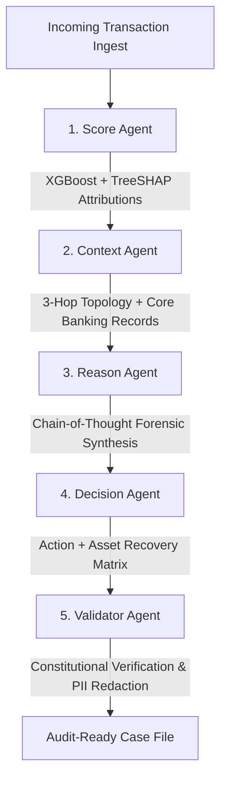
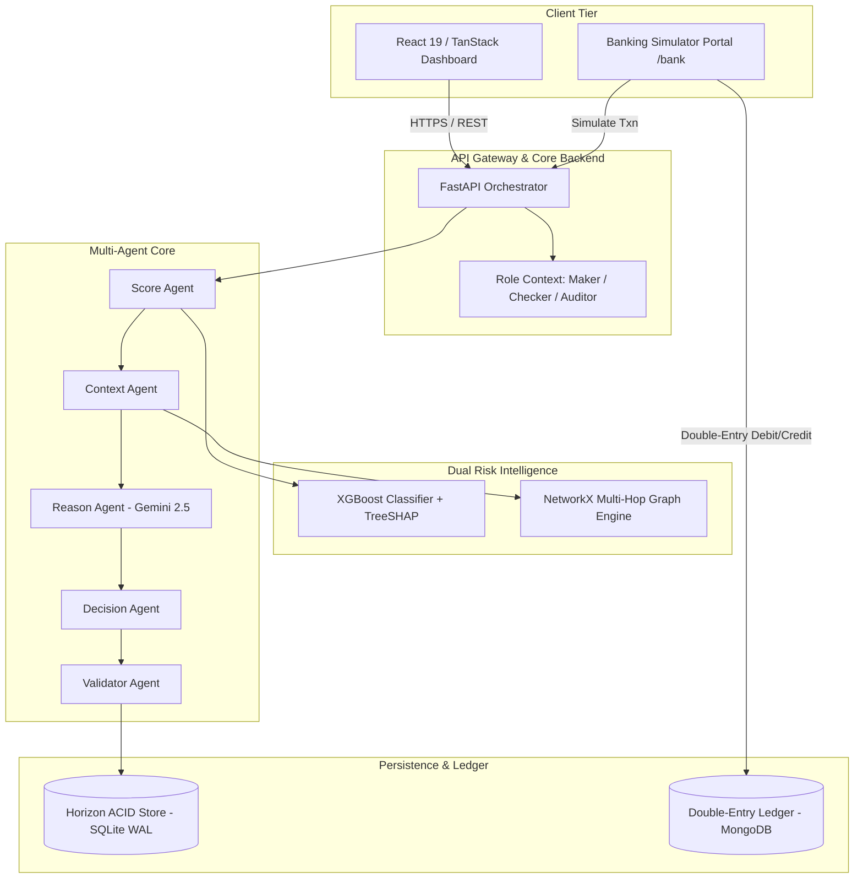

# SafeFlow: Autonomous Financial Crime Investigation & AML Decision Intelligence Platform

<div align="center">


**Real-time transaction surveillance, multi-agent AI investigation, and regulatory compliance platform engineered for modern commercial banks, payment gateways, and regulatory compliance teams.**

[](https://ledger-sigma-gules.vercel.app)
[](https://smarthorizon.onrender.com)
[](https://smarthorizon.onrender.com/docs)
[](https://python.org)
[](https://typescriptlang.org)
[](https://rbi.org.in)

</div>

---

## 🌐 Live Production Deployments

| Component | Production URL | Status / Description |
| :--- | :--- | :--- |
| **Investigator Web App** | [https://ledger-sigma-gules.vercel.app](https://ledger-sigma-gules.vercel.app) | Enterprise dashboard, case triage, graph canvas & Maker-Checker queue |
| **Core Banking Simulator** | [https://ledger-sigma-gules.vercel.app/bank](https://ledger-sigma-gules.vercel.app/bank) | Live financial rail simulator (UPI/IMPS/NEFT) injecting real transactions |
| **Investigation Core API** | [https://smarthorizon.onrender.com](https://smarthorizon.onrender.com) | FastAPI multi-agent engine, graph analytics & real-time scoring |
| **Interactive API Docs** | [https://smarthorizon.onrender.com/docs](https://smarthorizon.onrender.com/docs) | OpenAPI / Swagger specification with live interactive testing |
| **System Health Check** | [https://smarthorizon.onrender.com/health](https://smarthorizon.onrender.com/health) | Live service liveness and component readiness check |

---

## 📌 Executive Summary & The Problem

Financial institutions process billions of transactions daily, yet Anti-Money Laundering (AML) and Fraud Risk Management (FRM) operations remain plagued by structural inefficiencies:

1. **Massive False Positive Crisis:** Over **95% of rule-based transaction alerts** generated by legacy AML engines are false positives, consuming thousands of human-analyst hours per week.
2. **The PMLA ₹50,000 Structuring Loophole:** Under **Section 12 of the Prevention of Money Laundering Act (PMLA) 2002**, banks are mandated to report cash/fund transfers exceeding ₹50,000. Organized financial crime syndicates exploit this rigid rule by systematically splitting illicit funds into sub-threshold tranches (e.g., ₹48,000, ₹49,500, ₹34,500) routed through mule accounts.
3. **Single-Point ML Blindness:** Machine learning classifiers evaluating transactions in isolation will score a daytime transfer of ₹48,500 as safe (~5–10% risk) because the amount, timing, and velocity of that single transfer appear unremarkable. The model cannot see that across the network topology, it represents **Hop 3 of an orchestrated funnel drain**.
4. **Regulatory Audit Failure & Black-Box Decisions:** Regulators (RBI, FIU-IND, FATF) reject black-box AI scores without explainable, statutory justifications. Compliance officers cannot defend a frozen account in court simply by stating "the neural network scored it 0.89".

### How SafeFlow Solves This

SafeFlow introduces an **Autonomous Multi-Agent Financial Crime Investigation Platform** that unifies:
- **Dual Risk Intelligence (ML Point Risk + Graph Network Topology Risk)** to expose sub-threshold structuring rings.
- **5-Agent Autonomous Investigation Pipeline** (Scoring, Context, LLM Reasoning, Decisioning, and Constitutional Validation).
- **Statutory Grounding** mapped directly to PMLA 2002, RBI Master Direction on KYC (2016), RBI FRM Master Direction (2024), and NPCI OC 138.
- **RBI Maker-Checker Institutional Governance** enforcing the three lines of defense with zero unilateral account freezing.

---

## 🔬 Core Innovations

### 1. Dual Risk Intelligence Engine

SafeFlow eliminates the blind spot between statistical anomalies and network topology:

```
┌─────────────────────────┐         ┌─────────────────────────┐
│     ML Point Score      │         │   Graph Network Score   │
│  (XGBoost + TreeSHAP)   │         │ (NetworkX Multi-Graph)  │
│                         │         │                         │
│ • Amount-to-balance     │         │ • In/Out-degree anomaly │
│ • Velocity spikes       │         │ • Rapid dispersal hops  │
│ • Historical deviations │         │ • Mule pooling / funnel │
│ • Off-hours execution   │         │ • Circular layering     │
└───────────┬─────────────┘         └────────────┬────────────┘
            │                                    │
            ▼                                    ▼
       ML_Risk (0-100)                     Graph_Risk (0-100)
            │                                    │
            └───────────────┬────────────────────┘
                            │
                            ▼
              ┌───────────────────────────┐
              │    Composite Hybrid Risk   │
              │  0.45*ML + 0.55*Graph     │
              │  + Structuring Multiplier │
              └───────────────────────────┘
```

- **ML Risk Vector:** Evaluates 14 statistical features using an XGBoost classifier trained on financial crime datasets, providing real-time TreeSHAP feature attributions.
- **Graph Risk Vector:** Traverses a directed multigraph representing account transfers up to 3 hops away, computing in-degree pooling, out-degree dispersion, time-delta velocities between hops, and cycle loops.
- **Structuring Multiplier:** Detects transactions sitting just below the statutory threshold ($40,000 \le \text{amount} \le 49,999$) exhibiting rapid pass-through velocity ($< 120\text{ seconds}$). It automatically elevates the composite risk to high/critical even if single-point ML scored low.

---

### 2. 5-Agent Autonomous Investigation Pipeline

Rather than relying on a single prompt, SafeFlow executes a strictly segregated, role-specialized agent pipeline:



1. **Score Agent:** Ingests raw payload, extracts behavioral signals, computes XGBoost probability, and calculates SHAP values to identify the primary statistical drivers.
2. **Context Agent:** Traverses the entity graph up to 3 degrees, queries historical Core Banking records (CBS), checks KYC risk categories, and evaluates device binding fingerprints.
3. **Reason Agent:** Powered by Gemini 2.5 Pro / Flash. Performs structured Chain-of-Thought forensic synthesis, identifying specific laundering techniques (smurfing, layering, mule concentration, round-tripping).
4. **Decision Agent:** Computes the recommended enforcement action (`APPROVE`, `MONITOR`, `FREEZE_ACCOUNT`, `BLOCK_TRANSACTION`, `ESCALATE_SAR_STR`), generates the **Asset Recovery & Freeze Priority Matrix**, and runs the **Counterfactual "What-If" Engine**.
5. **Validator Agent:** Acts as an independent constitutional auditor. Cross-examines the forensic report against statutory mandates, verifies zero hallucinated account balances or timestamps, ensures PII masking, and certifies the case before human presentation.

---

### 3. Institutional Governance: RBI Maker-Checker Architecture

To prevent unauthorized account blocks and adhere to banking audit requirements, SafeFlow implements a strict **Three Lines of Defense** model:

```
 ┌─────────────────────────────────────────────────────────────┐
 │       1st Line of Defense: Investigator / Analyst (Maker)   │
 │ • Triage cases filtered by risk & anomaly score             │
 │ • Deep-dive into interactive force-directed graph canvas     │
 │ • Inspect SHAP waterfall explanations & counterfactuals     │
 │ • Propose action: Request Freeze / Escalate STR / Dismiss   │
 └──────────────────────────────┬──────────────────────────────┘
                                │ Submits Proposed Action
                                ▼
 ┌─────────────────────────────────────────────────────────────┐
 │       2nd Line of Defense: Compliance Manager (Checker)     │
 │ • Centralized Approval Queue (/dashboard/approvals)         │
 │ • Independent validation of investigator rationale          │
 │ • Executive authority: Approve Freeze, Reject, or Reinvest  │
 │ • Zero unilateral freezing — strict 4-eye principle         │
 └──────────────────────────────┬──────────────────────────────┘
                                │ Cryptographic Audit Event
                                ▼
 ┌─────────────────────────────────────────────────────────────┐
 │       3rd Line of Defense: Audit, Risk & Regulators         │
 │ • Append-only, tamper-evident cryptographic audit trail     │
 │ • Logs all agent executions, analyst clicks & decisions     │
 │ • Exportable FIU-IND compliant STR XML dossiers             │
 └─────────────────────────────────────────────────────────────┘
```

---

### 4. Asset Recovery & Freeze Priority Matrix

When multi-hop laundering is detected, freezing only the originator account is useless because funds have already escaped into downstream mule accounts.

SafeFlow's Decision Agent automatically traverses downstream hops and ranks every connected account by:
- **Available Liquidity:** Current balance retained in the account.
- **Flight Risk:** Velocity of recent debit transactions.
- **Freeze Urgency:** Priority ranking (`P1 - Urgent Halt`, `P2 - Secondary Conduit`, `P3 - Monitor Source`).
- **Preserved Capital Metric:** Calculates the exact quantum of funds recoverable before cash-out at ATM or crypto OTC ramps.

---

### 5. Counterfactual "What-If" Explainability Engine

Explaining an AI decision requires more than feature weights; compliance officers must understand what changes would alter the outcome:
- *"What if the transaction occurred during regular daylight hours?"*
- *"What if the recipient had a 12-month verified KYC merchant history?"*
- *"What if the amount was split across 48 hours instead of 60 seconds?"*

The engine runs live simulations against the XGBoost and Graph models, demonstrating to regulators that the system is deterministic, fair, and calibrated.

---

## 🏛️ Statutory & Regulatory Alignment

SafeFlow is built from the ground up to comply with Indian and global AML/CFT regulatory frameworks:

| Regulatory Mandate | Section / Directive | SafeFlow Implementation |
| :--- | :--- | :--- |
| **PMLA 2002** | Section 12 | Automated CTR generation and Suspicious Transaction Report (STR) drafting. |
| **RBI Master Direction - KYC** | Section 35 / 38 | Dynamic Customer Due Diligence (CDD) and Enhanced Due Diligence (EDD) alerts. |
| **RBI Master Direction - FRM (2024)** | Early Fraud Detection | Golden Hour fraud containment with automated freeze priority workflows. |
| **NPCI Operating Circular 138** | UPI Risk Mitigation | Real-time device binding analysis and rapid beneficiary recall tracing. |
| **FIU-IND Reporting Standards** | Suspicious Activity Reports | Single-click export of FIU-compliant dossiers with full clause traceability. |

---

## 🏗️ System Architecture



---

## 📂 Repository Structure

```
horizon/
├── backend/                        # FastAPI Python Core
│   ├── main.py                     # App entry point, CORS, and lifecycle
│   ├── state.py                    # Global state & model loader
│   ├── features.py                 # 14-signal feature engineering pipeline
│   ├── regulatory.py               # Statutory rule definitions (PMLA, RBI, NPCI)
│   ├── fraud_model.pkl             # Trained XGBoost binary model
│   ├── model_metadata.json         # Feature importance & metadata
│   ├── routers/
│   │   ├── ingest.py               # Real-time transaction ingestion
│   │   ├── score.py                # Single-point scoring & SHAP attribution
│   │   ├── graph.py                # 3-hop multi-graph clustering & topology
│   │   ├── investigate.py          # 5-Agent pipeline execution & LLM forensics
│   │   ├── cases.py                # Case lifecycle, triage & Maker-Checker review
│   │   ├── simulator.py            # Banking simulator transaction triggers
│   │   ├── audit.py                # Append-only audit log verification
│   │   └── reports.py              # FIU-IND STR report generator
│   ├── tests/                      # Automated test suite (66 tests)
│   └── requirements.txt            # Python dependencies
│
├── frontend/                       # React 19 + TanStack Start UI
│   ├── src/
│   │   ├── routes/
│   │   │   ├── index.tsx           # Institutional landing page
│   │   │   ├── bank.tsx            # Live Core Banking Simulator (/bank)
│   │   │   └── dashboard/
│   │   │       ├── cases/          # Case triage & investigative workspace
│   │   │       ├── approvals.tsx   # Manager Maker-Checker queue
│   │   │       ├── audit.tsx       # Immutable compliance audit log
│   │   │       ├── graph.tsx       # Fullscreen interactive graph canvas
│   │   │       └── reports.tsx     # Regulatory report export
│   │   ├── components/
│   │   │   ├── investigation/      # Graph canvas, SHAP charts, Clause traceability
│   │   │   ├── dashboard/          # Header, Sidebar, StatCards, RoleSelector
│   │   │   └── landing/            # Visual architecture, Trust bar, Feature showcases
│   │   ├── context/
│   │   │   ├── RoleContext.tsx     # Role-based access control (Maker vs. Checker)
│   │   │   └── ThemeContext.tsx    # Dark/Light government theme engine
│   │   └── lib/                    # API client, error handling, utilities
│   ├── package.json
│   └── vite.config.ts
│
├── ledger/                         # Core Banking Double-Entry Microservice
│   ├── server.js                   # Express server entry point
│   ├── src/
│   │   ├── models/                 # Account, Ledger, Transaction Mongoose models
│   │   ├── controller/             # Transfer, deposit, and balance controllers
│   │   └── routes/                 # Transaction & auth routing
│   └── package.json
│
├── render.yaml                     # Render deployment configuration
├── .gitignore                      # Git exclusion rules
└── README.md                       # Project documentation
```

---

## 🚀 Local Installation & Quickstart

### Prerequisites

- **Python:** 3.11 or higher
- **Node.js:** 18.x or higher
- **npm** or **bun**
- **MongoDB:** (Optional, for running the standalone Ledger microservice locally)

---

### 1. Backend Setup (FastAPI)

```bash
# Navigate to backend directory
cd backend

# Create and activate virtual environment
python -m venv venv
# On Windows:
.\venv\Scripts\activate
# On Linux/macOS:
source venv/bin/activate

# Install dependencies
pip install -r requirements.txt

# Configure environment variables
# Create a .env file in backend/
cat << 'EOF' > .env
PORT=8000
ENVIRONMENT=development
GEMINI_API_KEY=your_gemini_api_key_here
ENABLE_LLM=true
CORS_ORIGINS=http://localhost:8080,http://localhost:5173,https://ledger-sigma-gules.vercel.app
EOF

# Start backend server
uvicorn main:app --host 0.0.0.0 --port 8000 --reload
```

The backend is now live at `http://localhost:8000` (Docs: `http://localhost:8000/docs`).

---

### 2. Frontend Setup (React 19 + TanStack)

```bash
# Navigate to frontend directory
cd ../frontend

# Install dependencies
npm install

# Start Vite dev server
npm run dev
```

The frontend is now live at `http://localhost:8080` (or `http://localhost:5173`).

---

### 3. Banking Ledger Microservice (Optional)

```bash
# Navigate to ledger directory
cd ../ledger

# Install dependencies
npm install

# Start Express ledger server
npm start
```

---

## 🧪 Interactive Demo Scenarios

SafeFlow includes pre-configured financial crime attack patterns accessible directly through the **Banking Simulator** (`/bank`):

### Scenario 1: The PMLA ₹50,000 Structuring Loophole (Multi-Hop Ring)
- **Attack Flow:** An originator transfers ₹48,500 to Mule Account A, which immediately passes ₹48,000 to Mule Account B, which routes ₹47,500 to a cash-out hub.
- **Expected Outcome:** 
  - Single-Point ML: Low/Medium risk (~8–15%) because individual amounts fall below ₹50,000.
  - Graph Intelligence: Flags **High Risk (90%+)** due to high-velocity pass-through ($< 60\text{s}$) and funnel topology.
  - Overall Case: Triaged as `CRITICAL`, triggers structuring clause violation under PMLA Section 12.

### Scenario 2: High-Value Sudden Spike on Dormant Account
- **Attack Flow:** A dormant account with average balance of ₹2,500 receives an unexpected inbound transfer of ₹850,000 at 02:30 AM followed by an immediate external RTGS attempt.
- **Expected Outcome:** 
  - ML Risk: 98% (High balance deviation, off-hours execution).
  - Graph Risk: Detects sudden in-degree spike on inactive node.
  - Action: Immediate `BLOCK_TRANSACTION` and P1 freeze on recipient.

### Scenario 3: Fan-Out Rapid Mule Dispersal
- **Attack Flow:** A corporate account receives a large deposit and within 90 seconds disperses the entire sum in 10 equal micro-payments to unrelated newly created UPI VPAs.
- **Expected Outcome:**
  - Graph Analytics: Out-degree centrality anomaly, high dispersion ratio.
  - Decision Agent: Populates the Asset Recovery Matrix with all 10 target accounts ranked by recoverable balance.

---

## 📡 Core API Reference

### 1. Ingest Transaction
```http
POST /api/ingest/transaction
Content-Type: application/json

{
  "sender_id": "ACC_99281726",
  "receiver_id": "ACC_44129831",
  "amount": 48500.00,
  "transaction_type": "TRANSFER",
  "timestamp": "2026-09-05T10:00:00Z",
  "device_id": "DEV_ANDROID_99182",
  "ip_address": "103.21.14.88"
}
```

### 2. Score Transaction (Real-time ML & SHAP)
```http
POST /api/score/transaction
Content-Type: application/json

{
  "sender_id": "ACC_99281726",
  "receiver_id": "ACC_44129831",
  "amount": 48500.00,
  "transaction_type": "TRANSFER"
}
```
**Response:**
```json
{
  "ml_score": 12.4,
  "risk_level": "LOW",
  "shap_attributions": {
    "amount_to_balance_ratio": 0.18,
    "hour_of_day": -0.05,
    "velocity_1h": 0.02
  }
}
```

### 3. Run Autonomous Multi-Agent Investigation
```http
POST /api/investigate/run
Content-Type: application/json

{
  "case_id": "FC-20260905-STR8819"
}
```
**Response:** Complete multi-agent case analysis containing graph topology, LLM reasoning trace, recommended action, freeze priority matrix, and constitutional certification.

### 4. Maker-Checker Case Decision
```http
POST /api/cases/{case_id}/decision
Content-Type: application/json

{
  "analyst_id": "ANALYST_07",
  "proposed_action": "FREEZE_ACCOUNT",
  "justification": "Identified 4-hop structuring ring evading PMLA threshold. Retained liquidity in hop 3 is 92%."
}
```

### 5. Compliance Manager Approval (Checker)
```http
POST /api/cases/{case_id}/approve
Content-Type: application/json

{
  "manager_id": "MGR_COMPLIANCE_02",
  "decision": "APPROVED",
  "notes": "Verified freeze priority matrix. Executive freeze authorized under RBI FRM 2024."
}
```

---

## 👥 Roles & Maker-Checker Permission Matrix

| Function / Action | Analyst (Maker) | Compliance Manager (Checker) | Auditor (3rd Line) |
| :--- | :---: | :---: | :---: |
| View Cases & Triage | ✅ | ✅ | ✅ |
| Run AI Investigation | ✅ | ✅ | ❌ |
| Interact with Graph Canvas | ✅ | ✅ | ✅ |
| Propose Freeze / Block | ✅ | ❌ (Reviews) | ❌ |
| Approve Account Freeze | ❌ | ✅ | ❌ |
| Reject / Return Case | ❌ | ✅ | ❌ |
| Export FIU STR Dossier | ✅ | ✅ | ✅ |
| View Cryptographic Audit Log | ❌ | ✅ | ✅ |

---

## 🛡️ Security, Privacy & Integrity

- **PII Redaction Engine:** Customer identifiers, account numbers, and device fingerprints are masked before transmission to external LLM providers (e.g., `ACC_****1298`).
- **Cryptographic Audit Log:** All events are recorded in an append-only, tamper-evident log containing timestamp, actor ID, IP address, previous hash, and operation payload.
- **Fail-Safe Fallback:** If the external LLM is unreachable, the system falls back to a deterministic rule-based compliance engine ensuring 100% operational uptime for transaction clearance.

---

## 📜 License & Acknowledgments

This project is licensed under the **MIT License**.

Engineered for modern financial institutions, payment networks, and compliance officers dedicated to safeguarding the integrity of digital financial rails.
